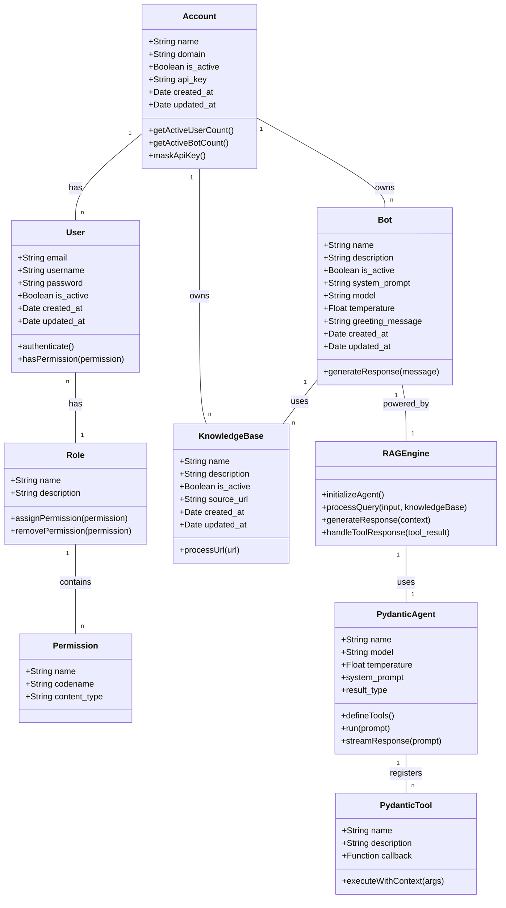

```mermaid
classDiagram
    class Account {
        +String name
        +String domain
        +Boolean is_active
        +String api_key
        +Date created_at
        +Date updated_at
        +getActiveUserCount()
        +getActiveBotCount()
        +maskApiKey()
    }

    class User {
        +String email
        +String username
        +String password
        +Boolean is_active
        +Date created_at
        +Date updated_at
        +authenticate()
        +hasPermission(permission)
    }

    class Role {
        +String name
        +String description
        +assignPermission(permission)
        +removePermission(permission)
    }

    class Permission {
        +String name
        +String codename
        +String content_type
    }

    class Bot {
        +String name
        +String description
        +Boolean is_active
        +String system_prompt
        +String model
        +Float temperature
        +String greeting_message
        +Date created_at
        +Date updated_at
        +generateResponse(message)
    }

    class KnowledgeBase {
        +String name
        +String description
        +Boolean is_active
        +String source_url
        +Date created_at
        +Date updated_at
        +processUrl(url)
    }

    class RAGEngine {
        +initializeAgent()
        +processQuery(input, knowledgeBase)
        +generateResponse(context)
        +handleToolResponse(tool_result)
    }

    class PydanticAgent {
        +String name
        +String model
        +Float temperature
        +system_prompt
        +result_type
        +defineTools()
        +run(prompt)
        +streamResponse(prompt)
    }

    class PydanticTool {
        +String name
        +String description
        +Function callback
        +executeWithContext(args)
    }

    Account "1" -- "n" User : has
    Account "1" -- "n" Bot : owns
    Account "1" -- "n" KnowledgeBase : owns
    User "n" -- "1" Role : has
    Role "1" -- "n" Permission : contains
    Bot "1" -- "n" KnowledgeBase : uses
    RAGEngine "1" -- "1" PydanticAgent : uses
    PydanticAgent "1" -- "n" PydanticTool : registers
    Bot "1" -- "1" RAGEngine : powered_by
```
