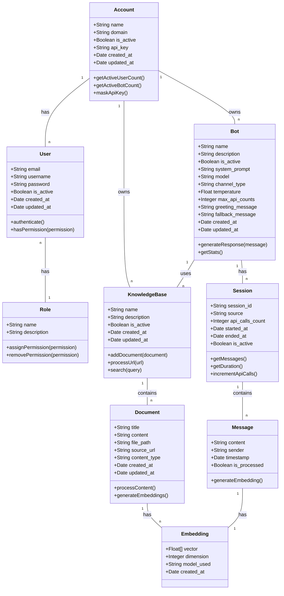

# Diagram de class

```mermaid
classDiagram
    class Account {
        +String name
        +String domain
        +Boolean is_active
        +String api_key
        +Date created_at
        +Date updated_at
        +getActiveUserCount()
        +getActiveBotCount()
        +maskApiKey()
    }

    class User {
        +String email
        +String username
        +String password
        +Boolean is_active
        +Date created_at
        +Date updated_at
        +authenticate()
        +hasPermission(permission)
    }

    class Role {
        +String name
        +String description
        +assignPermission(permission)
        +removePermission(permission)
    }

    class Bot {
        +String name
        +String description
        +Boolean is_active
        +String system_prompt
        +String model
        +String channel_type
        +Float temperature
        +Integer max_api_counts
        +String greeting_message
        +String fallback_message
        +Date created_at
        +Date updated_at
        +generateResponse(message)
        +getStats()
    }

    class KnowledgeBase {
        +String name
        +String description
        +Boolean is_active
        +Date created_at
        +Date updated_at
        +addDocument(document)
        +processUrl(url)
        +search(query)
    }

    class Document {
        +String title
        +String content
        +String file_path
        +String source_url
        +String content_type
        +Date created_at
        +Date updated_at
        +processContent()
        +generateEmbeddings()
    }

    class Session {
        +String session_id
        +String source
        +Integer api_calls_count
        +Date started_at
        +Date ended_at
        +Boolean is_active
        +getMessages()
        +getDuration()
        +incrementApiCalls()
    }

    class Message {
        +String content
        +String sender
        +Date timestamp
        +Boolean is_processed
        +generateEmbedding()
    }

    class Embedding {
        +Float[] vector
        +Integer dimension
        +String model_used
        +Date created_at
    }

    Account "1" -- "n" User : has
    Account "1" -- "n" Bot : owns
    Account "1" -- "n" KnowledgeBase : owns
    User "n" -- "1" Role : has
    KnowledgeBase "1" -- "n" Document : contains
    Bot "1" -- "n" KnowledgeBase : uses
    Bot "1" -- "n" Session : has
    Session "1" -- "n" Message : contains
    Document "1" -- "n" Embedding : has
    Message "1" -- "1" Embedding : has
```
